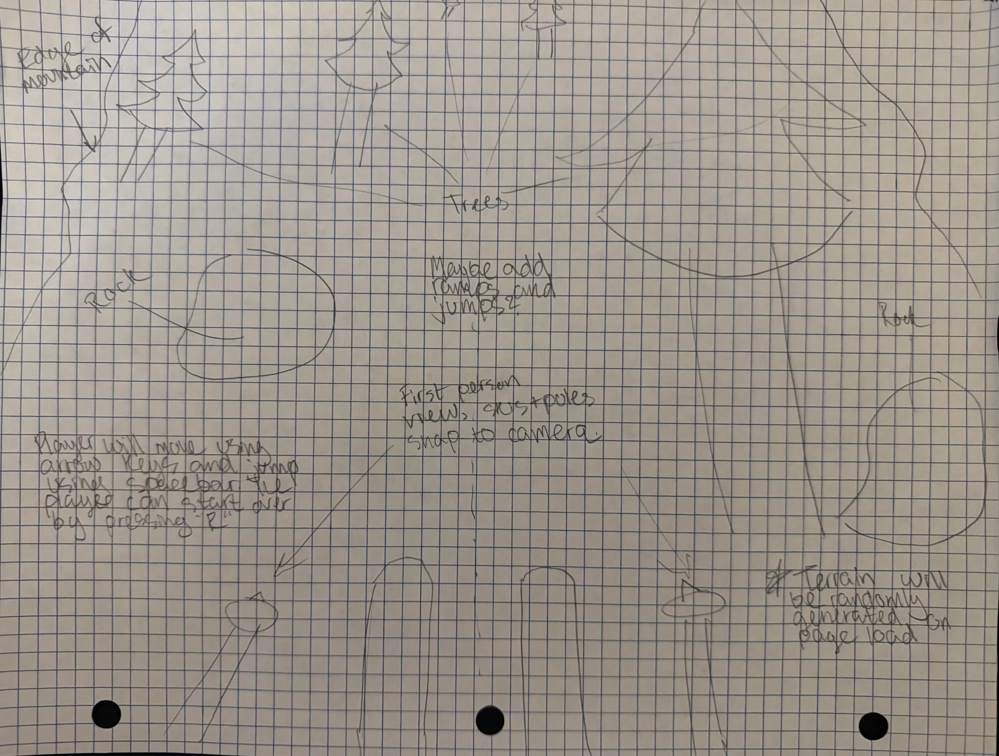
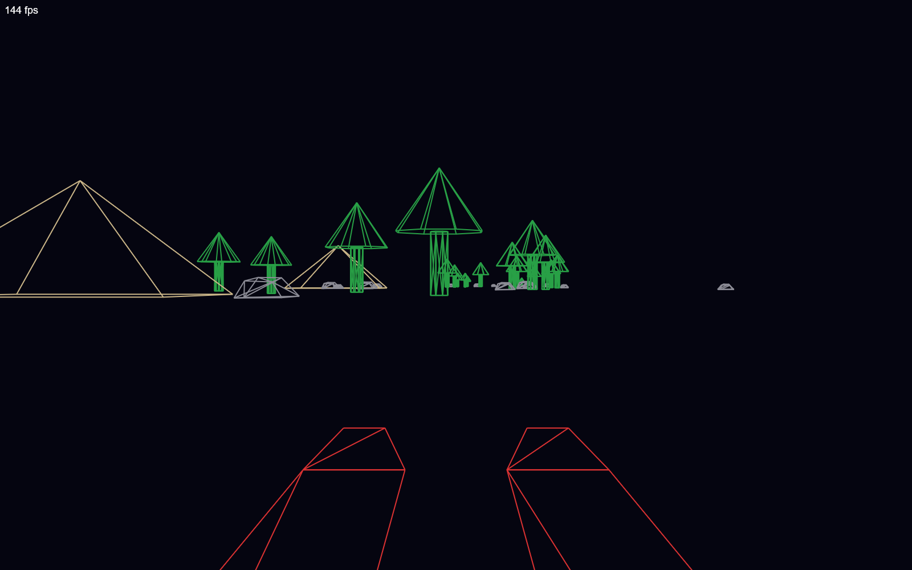
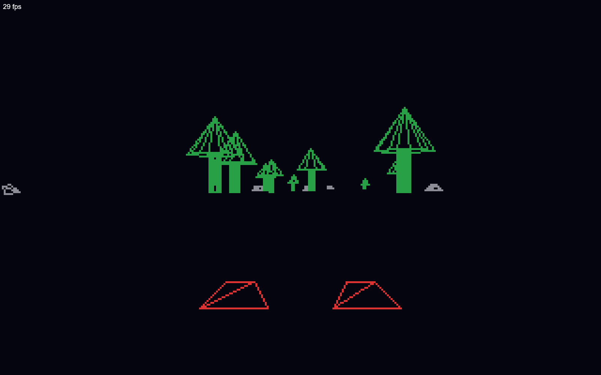
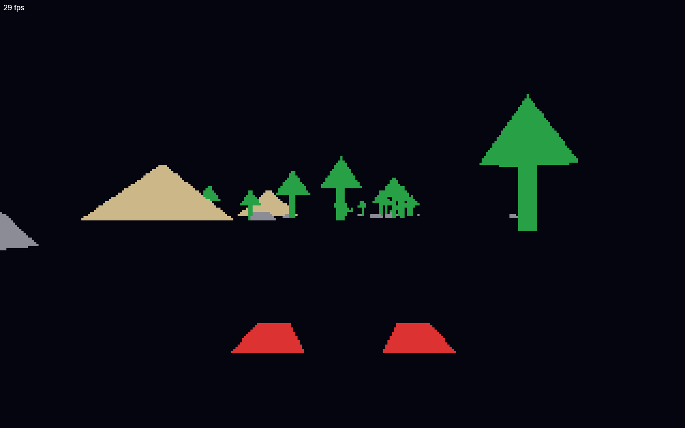

# Project 1: Pinhole camera, rasterized display

**[Live Site](https://collinb.me/cs5160/project1.html)**

**[Demo Video](https://www.youtube.com/watch?v=oWT_glcvfQU)**

## Instructions

### Controls

- Left/Right Arrows: Move left and right
- Spacebar: Jump
- Up Arrow: Move faster
- Down Arrow: Move slower + fall faster
- R: Restart to the original position

### Change Render Mode

Click the _Toggle Render Mode_ button to cycle through the three rendering modes

1. Wireframe
2. Lower Resolution (320x200) display with custom line drawing
3. Lower Resolution (320x200) display with face drawing

## Design

The original design for this simulation was to have the player ski down a mountain covered with randomly generated obstacles. The player would be able to move left and right using the arrow keys, and also jump using spacebar. I also planned to add some ramps or jumps that the player could hit to get a boost into the air. There is not any clear objective or way to "win", and therefore this is more of an interactive art display than a game.

Due to time constraints, I was not able to add the ramps. Additionally, I was not able to add collision, so the player goes straight through objects. However, the core features of randomly generated terrain and movement are implemented in the final simulation.

## Implementation

### .obj Parsing

One of the first things I did was create a parser that reads the contents of a .obj file and outputs an array of vertices and faces. I also created a Mesh class which stores this output and extracts all of the possible edges from the faces (I designed the objects to only have triangular faces to keep it simple).

The Meshes are only created once and then shared in among the WorldObject classes. For example, the data for a tree is only read once, and the vertices, edges, and faces are shared with other instances of trees. The WorldObject class has additional properties for translation and scaling, which are unique.

### Pinhole Camera Projection

All of the objects are sorted by z value from furthest to closest. Each vertex of each object is looped through to get the camera-relative positions. After this, each edge is looped through, and edges with a vertex behind the camera are clipped to the near plane (directly in front of the camera). The 2d screen position for both vertices in the edge are calculated using pinhole projection. Then, the line is drawn using either the built in draw line method or the custom pixelated method depending on the render mode.

**Sources:**

- https://gabrielgambetta.com/computer-graphics-from-scratch/11-clipping.html

### Pixelated Line Drawing

This function uses the incremental approach, starting at the leftmost x coordinate. If there is a greater increase in x than y, then x is looped from x1 to x2 and the y is calculated using the slope. If there is a greater increase in y than x, then y is looped from y1 to y2 and the x is calculated using the slope.

### Triangle Rasterizing

Faces are drawn using barycentric coordinates for each pixel in the bounding box of the triangle. If all of the weights are positive, then the z is calculated and compared against the current z-buffer value. If it is lower (closer to the camera), then the pixel color is added to the pixel grid, and the new z value is added to the z-buffer. This way, the closer pixels are rendered in front of the further ones.

**Sources:**

- https://jtsorlinis.github.io/rendering-tutorial/

### Game Loop

Because the FPS drops significantly from wireframe to pixelated modes, movement updates are calculated using the change in time between each frame. This way, the player movement feels like it has the same speed regardless of FPS. Each frame, the ski objects are moved to right below the camera to give the illusion of being in first person.

**Sources:**

- https://spicyyoghurt.com/tutorials/html5-javascript-game-development/create-a-proper-game-loop-with-requestanimationframe

## Future Developments

For future work on this project, my main priority would be to fix some of the rendering bugs. For example:

- In pixelated display modes, half of the ski is hidden due to clipping
- When part of an edge goes off screen in pixelated display mode, the entire edge disappears.
- Generally low FPS in rasterized mode.

After fixing these issues, I would add some of the other originally planned features:

- Collision when the player hits an obstacle, sending them back to the top automatically
- Infinite terrain so the player doesn't need to reset at the end
- More obstacles
- Boundaries on the sides
- Multiple colors for objects
- Shading for faces
